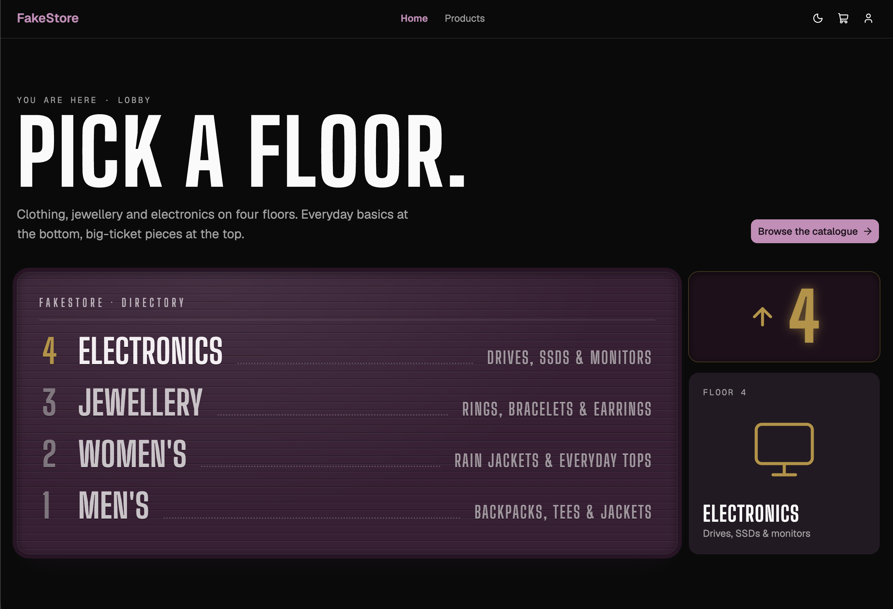

# FakeStore

A production-style e-commerce storefront built on the [FakeStore API](https://fakestoreapi.com), written to show how a modern React app is put together in 2026: React 19, React Router data routers, TanStack Query, Zustand, Zod, React Hook Form, Tailwind CSS v4 and shadcn/ui, tested with Vitest, Testing Library and MSW.

The point of the project isn't the shop itself. It's the decisions behind it: where each piece of state lives, how data is fetched before a page renders, how loading and error states are scoped, how optimistic updates roll back, and how all of it is tested against a mocked network without mocking a single module.

[Live demo](https://fakestore-vite.vercel.app/)

[](https://fakestore-vite.vercel.app/)

---

## Contents

- [Highlights](#highlights)
- [Tech stack](#tech-stack)
- [Getting started](#getting-started)
- [Scripts](#scripts)
- [Project structure](#project-structure)
- [Architecture](#architecture)
- [Patterns worth reading](#patterns-worth-reading)
- [Accessibility](#accessibility)
- [Performance](#performance)
- [Testing](#testing)
- [Tooling and code quality](#tooling-and-code-quality)
- [CI and deployment](#ci-and-deployment)
- [Working around FakeStore](#working-around-fakestore)

---

## Highlights

- **One owner per kind of state.** Server data lives in the TanStack Query cache, client state in small Zustand stores, filters in the URL and transient UI state in `useState`. Nothing is duplicated between them.
- **Render-as-you-fetch.** Route loaders warm the query cache while the lazily loaded page component downloads, so data and code arrive in parallel.
- **Runtime-validated API layer.** Every response is parsed with Zod, so the TypeScript types and what the server actually sent can't drift apart silently.
- **Scoped Suspense and error boundaries.** A failing "related products" section shows its own retry button; the rest of the page keeps working.
- **Optimistic checkout with rollback.** The order appears in your history immediately and is removed again, precisely, if the request fails.
- **The URL is the source of truth for browsing.** Category, sort, search and page are all search params, so every view is shareable, survives a refresh and works with Back and Forward.
- **Accessible by default.** Skip link, focus management on navigation, live regions for async updates, labelled forms and reduced-motion support.
- **Tested at the network boundary.** MSW intercepts real HTTP requests, so the axios client, interceptors, Zod parsing, query cache and router all run in tests exactly as they do in the browser.

## Tech stack

| Concern        | Library                                                                                                          | Why                                                                                                |
| -------------- | ---------------------------------------------------------------------------------------------------------------- | -------------------------------------------------------------------------------------------------- |
| UI             | [React 19](https://react.dev)                                                                                    | Native`<title>` metadata, `useEffectEvent`, `useSyncExternalStore`, StrictMode-safe effects        |
| Build          | [Vite 8](https://vite.dev) + TypeScript 6                                                                        | Instant dev server, fast production builds,`import.meta.env` for config                            |
| Routing        | [React Router 8](https://reactrouter.com) (data router)                                                          | Loaders, redirects, lazy routes, route-level error boundaries, scroll restoration                  |
| Server state   | [TanStack Query 5](https://tanstack.com/query)                                                                   | Caching, deduplication, retries, Suspense, placeholder data, optimistic mutations, offline pausing |
| Client state   | [Zustand 5](https://zustand.docs.pmnd.rs)                                                                        | Tiny stores with`persist` and `devtools` middleware, readable outside React (in loaders)           |
| HTTP           | [axios](https://axios-http.com)                                                                                  | Interceptors to normalise errors, timeouts,`AbortSignal` cancellation, query-string encoding       |
| Validation     | [Zod 4](https://zod.dev)                                                                                         | One schema gives both the runtime check and the static type                                        |
| Forms          | [React Hook Form](https://react-hook-form.com) + `@hookform/resolvers`                                           | Uncontrolled inputs, Zod-driven validation, form-level server errors                               |
| Styling        | [Tailwind CSS v4](https://tailwindcss.com)                                                                       | CSS-first config with`@theme`, OKLCH design tokens, class-based dark mode                          |
| Components     | [shadcn/ui](https://ui.shadcn.com) on [Base UI](https://base-ui.com)                                             | Accessible primitives you own and can edit, not a dependency you fight                             |
| Feedback       | [Sonner](https://sonner.emilkowal.ski), [lucide-react](https://lucide.dev)                                       | Toasts and icons                                                                                   |
| Error handling | [react-error-boundary](https://github.com/bvaughn/react-error-boundary)                                          | Resettable boundaries wired into TanStack Query's error reset                                      |
| Testing        | [Vitest 5](https://vitest.dev), [Testing Library](https://testing-library.com), [MSW 3](https://mswjs.io), jsdom | Fast tests that query by role and mock at the network level                                        |
| Quality        | ESLint 10 (flat config, TanStack Query plugin), Prettier with the Tailwind plugin                                | Consistent code, sorted class names, Query-specific lint rules                                     |
| Delivery       | GitHub Actions, Vercel                                                                                           | Every push type-checked, linted, tested and built                                                  |

## Getting started

**Requirements:** Node 22+ and [pnpm](https://pnpm.io) (the exact version is pinned in `package.json` under `packageManager`, so `corepack enable` picks it up).

```bash
git clone https://github.com/De-Morgan/fakestore.git
cd fakestore
pnpm install
cp .env.example .env
pnpm dev
```

Then open http://localhost:5173.

### Demo account

FakeStore has a fixed set of users. Log in with **`mor_2314` / `83r5^_`**, or click **Use demo account** on the login page to fill the form.

### Environment variables

| Variable       | Example                    | Purpose                        |
| -------------- | -------------------------- | ------------------------------ |
| `VITE_API_URL` | `https://fakestoreapi.com` | Base URL for every API request |

Variables prefixed with `VITE_` are **public**: Vite inlines them into the JavaScript bundle at build time, so anyone can read them in the browser. Never put a secret in one. Changing one on a host requires a **rebuild**, not a restart.

## Scripts

| Script                         | What it does                                                               |
| ------------------------------ | -------------------------------------------------------------------------- |
| `pnpm dev`                     | Dev server with hot module replacement                                     |
| `pnpm build`                   | Type-check, then production build to`dist/`                                |
| `pnpm preview`                 | Serve the production build locally                                         |
| `pnpm typecheck`               | `tsc -b` across the app and Node configs                                   |
| `pnpm lint`                    | ESLint                                                                     |
| `pnpm format` / `format:check` | Prettier write / check                                                     |
| `pnpm test`                    | Vitest in watch mode                                                       |
| `pnpm test:run`                | Vitest, single run                                                         |
| `pnpm coverage`                | Vitest with V8 coverage; fails if`src/features/cart` drops below 90% lines |
| `pnpm analyze`                 | Production build plus a bundle treemap in`stats.html`                      |

## Project structure

The code is organised **by feature**, not by file type. Everything about the cart (store, selectors, mutation, components, page and tests) lives in one folder.

```
src/
├── api/
│   ├── client.ts          axios instance, ApiError, apiFetch (Zod-validated)
│   └── types.ts           Zod schemas and the types inferred from them
├── app/
│   ├── providers.tsx      QueryClientProvider, theme sync, toaster, devtools
│   ├── queryClient.ts     shared QueryClient and retry policy
│   └── router.ts          route tree factory, loaders, lazy routes
├── components/
│   ├── layout/            RootLayout, Header, MobileNav, UserMenu, Footer, OfflineBanner
│   ├── ui/                shadcn/ui components
│   ├── QueryBoundary.tsx  Suspense + resettable error boundary
│   └── SectionBoundary.tsx  a page region that loads and fails on its own
├── features/
│   ├── products/          list + detail pages, query options, URL param parsing, search
│   ├── cart/              Zustand cart store, selectors, checkout mutation, cart page
│   ├── auth/              auth store, login, route guards, JWT decoding, account page
│   └── theme/             theme store, toggle, <html> class sync
├── hooks/                 useDebouncedValue, useFocusOnNavigate
├── lib/                   formatting helpers, cn()
├── pages/                 Home, NotFound, ErrorPage
└── test/                  Vitest setup, MSW server/handlers/fixtures, renderWithProviders
```

Imports use the `@/` alias for `src/`.

## Architecture

### Who owns which state

Every piece of state has exactly one owner. Most bugs in React apps come from the same data living in two places.

| State              | Owner                                     | Examples                                          |
| ------------------ | ----------------------------------------- | ------------------------------------------------- |
| **Server** state   | TanStack Query cache                      | products, categories, user profile, order history |
| **Client** state   | Zustand stores, persisted to localStorage | cart lines, auth token, theme preference          |
| **URL** state      | Search params                             | `?category=`, `?sort=`, `?q=`, `?page=`           |
| **Local UI** state | `useState` / React Hook Form              | search box text before the debounce, form fields  |

API responses never get copied into a Zustand store, and filters never get copied into component state.

### Data flow

```
 URL params ──► ProductsPage ──► useQuery(productListQuery) ──► apiFetch ──► FakeStore API
                     │                    ▲
                     ▼                    │ select: search + paginate (no extra request)
               useCartStore ◄── AddToCartButton
                     │
                     ▼
 CartPage ──► useCheckoutMutation ──► optimistic write to the order-history cache ──► /account
```

### Routes

| Path            | Loader                    | Notes                                                      |
| --------------- | ------------------------- | ---------------------------------------------------------- |
| `/`             |                           | Home                                                       |
| `/products`     |                           | Filter, sort, search, paginate; all state in the URL       |
| `/products/:id` | `productDetailLoader`     | Awaits the product, prefetches related items, 404s cleanly |
| `/cart`         |                           | Edit quantities, checkout                                  |
| `/login`        | `redirectIfAuthenticated` | Honours a safe`?next=` redirect                            |
| `/account`      | `requireAuth`             | Profile and order history                                  |
| `*`             |                           | Not found                                                  |

Every page except Home is code-split with the route's `lazy` property, and the whole tree shares one `ErrorBoundary` route element for unexpected errors.

## Patterns worth reading

Each of these is a small, self-contained idea. The file links point at the real implementation.

### 1. A typed, validated API client

[src/api/client.ts](src/api/client.ts) wraps axios in a single function that takes a Zod schema:

```ts
export async function apiFetch<S extends z.ZodType>(
  path: string,
  schema: S,
  config?: AxiosRequestConfig,
) {
  const { data } = await http.request({ url: path, ...config });
  if (data === "" || data == null)
    throw new ApiError(404, `${path}: not found`);
  return schema.parse(data); // the return type is z.infer<S>
}
```

A response interceptor turns every failure (HTTP errors, timeouts, network loss) into one `ApiError` with a `status`, which the rest of the app can reason about. The global retry policy in [src/app/queryClient.ts](src/app/queryClient.ts) uses it: 4xx errors are never retried, 5xx and network errors are retried twice.

### 2. Query key factories and `queryOptions`

[src/features/products/api.ts](src/features/products/api.ts) defines keys hierarchically and exports reusable `queryOptions` objects:

```ts
export const productKeys = {
  all: ["products"] as const,
  lists: () => [...productKeys.all, "list"] as const,
  list: (filters: ProductFilters) => [...productKeys.lists(), filters] as const,
  detail: (id: number) => [...productKeys.all, "details", id] as const,
};

export const productListQuery = (filters: ProductFilters) =>
  queryOptions({
    queryKey: productKeys.list(filters),
    queryFn: ({ signal }) =>
      apiFetch(path, ProductListSchema, {
        params: { sort: filters.sort },
        signal,
      }),
  });
```

The same object is used by `useQuery`, `useSuspenseQuery`, `ensureQueryData` in loaders and `prefetchQuery`, so key and fetcher can never get out of sync. Passing `signal` means a navigation away cancels the request.

The detail query seeds itself from any cached list via `initialData`, so clicking a product card renders the detail page instantly with no spinner.

### 3. Render-as-you-fetch with route loaders

[src/app/router.ts](src/app/router.ts) uses loaders only to **warm the cache**, never to pass data to components:

```ts
const product = await queryClient.ensureQueryData(productDetailQuery(id)); // critical: await it
void queryClient.prefetchQuery(
  productListQuery({ category: product.category, sort: "asc" }),
); // nice-to-have: don't
return null;
```

The page then reads the same data with `useSuspenseQuery`, so the query cache stays the single source of truth and gets background refetching, devtools and invalidation for free. The loader runs in parallel with the lazy page download, and turns invalid ids and missing products into proper 404 responses.

`createRoutes({ queryClient })` is a factory, so tests can build the exact same route tree around a fresh client.

### 4. Scoped Suspense and error boundaries

[QueryBoundary](src/components/QueryBoundary.tsx) combines `Suspense`, `react-error-boundary` and TanStack Query's `QueryErrorResetBoundary`:

```tsx
<QueryErrorResetBoundary>
  {({ reset }) => (
    <ErrorBoundary onReset={reset} fallbackRender={/* message + "Try again" */}>
      <Suspense fallback={fallback}>{children}</Suspense>
    </ErrorBoundary>
  )}
</QueryErrorResetBoundary>
```

Wiring `onReset={reset}` matters: without it, "Try again" re-renders the boundary, the query rethrows its cached error, and nothing is refetched.

[SectionBoundary](src/components/SectionBoundary.tsx) wraps that in a labelled `<section>`, so the "More in this category" block on the product page loads and fails independently of the product itself.

### 5. The URL as state, with derived views

[src/features/products/searchParams.ts](src/features/products/searchParams.ts) splits URL params into two groups:

- **What to fetch** (`category`, `sort`) goes into the query key.
- **How to show it** (`q`, `page`) never does. Search and pagination run in the query's `select` function over the cached list, so typing in the search box never fires a request.

```ts
const select = useCallback(
  (products: Product[]) => toProductPage(products, { q, page }),
  [q, page],
);
const { data, isPlaceholderData } = useQuery({
  ...productListQuery(filters),
  select,
  placeholderData: keepPreviousData, // keep the old grid (dimmed) while a new category loads
});
```

Small details that make it feel right: defaults are left out of the URL, changing any filter resets `page`, an out-of-range `?page=99` clamps to the last page, and search updates use `replace` so refining a query doesn't flood the Back button.

### 6. Debounced search that respects history

[ProductSearch](src/features/products/components/ProductSearch.tsx) lets the input own every keystroke and writes to the URL only once typing settles ([useDebouncedValue](src/hooks/useDebouncedValue.ts)). It uses React 19's `useEffectEvent` to read the latest URL value without re-running the effect, and the "adjust state during render" pattern to resync the box when the user presses Back.

### 7. Small, persisted Zustand stores

[src/features/cart/cartStore.ts](src/features/cart/cartStore.ts) shows the shape every store follows:

- `persist` with a namespaced key, a `version` for future migrations and `partialize` so only data (not actions) is saved.
- `devtools` enabled in development only, with named actions (`"cart/addItem"`) for a readable Redux DevTools timeline.
- Cart lines keyed by product id (`Record<number, CartItem>`) for O(1) updates.
- Selectors in [selectors.ts](src/features/cart/selectors.ts), with `useShallow` for the derived array, so components re-render only when what they read changes.

Because Zustand stores live outside React, route loaders read them with `getState()`.

### 8. Optimistic checkout with precise rollback

[useCheckoutMutation](src/features/cart/api.ts) follows the full optimistic-update recipe:

1. `cancelQueries` so an in-flight refetch can't overwrite the optimistic write.
2. `ensureQueryData` so the new order is added to the real history rather than replacing it.
3. Insert the order with a negative temporary id, which can't clash with a server id and marks the row as pending in the UI.
4. Navigate to `/account` so the user sees it immediately.
5. On error, remove **only that row** (so a second checkout in flight isn't undone) and show a toast. On success, swap the temporary row for the server's and clear the cart.

In development you can force a failure to watch the rollback happen.

### 9. Route guards and safe redirects

[src/features/auth/requireAuth.ts](src/features/auth/requireAuth.ts) guards routes in loaders, before any component renders:

- `requireAuth` redirects to `/login?next=/account` when there's no token.
- `redirectIfAuthenticated` sends a signed-in user away from `/login`.
- `safeNext` only accepts same-origin paths, rejecting protocol-relative URLs like `//evil.example` (an open-redirect guard).

[useLogout](src/features/auth/useLogout.ts) is the single logout path: it clears the auth store **and** the whole query cache, so the next person on the device never sees the previous user's profile or orders.

The user id is read from the JWT payload with a Zod-validated decoder ([jwt.ts](src/features/auth/jwt.ts)) that is explicitly for UI only; it never verifies signatures.

### 10. Forms with React Hook Form and Zod

[LoginPage](src/features/auth/pages/LoginPage.tsx) validates on touch with a Zod resolver, maps a 401 to "Invalid username or password" via `setError("root")`, and keeps navigation in per-call `mutate` callbacks so it only runs while the page is mounted. Inputs are wired with `aria-invalid` and `aria-describedby` to their error messages.

### 11. Dark mode without a flash

The theme is a three-way setting (light, dark, system) stored in Zustand. A tiny inline script in [index.html](index.html) reads the persisted value and sets the `dark` class **before first paint**, and [useApplyTheme](src/features/theme/useApplyTheme.ts) keeps it in sync afterwards, including live OS theme changes when set to "system". Design tokens are OKLCH CSS variables in [src/index.css](src/index.css), consumed through Tailwind v4's `@theme`.

### 12. Offline awareness

[OfflineBanner](src/components/layout/OfflineBanner.tsx) subscribes to TanStack Query's `onlineManager` through `useSyncExternalStore`. While offline, queries pause instead of failing, cached data keeps rendering, and a `role="status"` banner announces the change.

## Accessibility

- **Skip link** as the first focusable element on every page.
- **Focus management:** after a client-side route change, [useFocusOnNavigate](src/hooks/useFocusOnNavigate.ts) moves focus to the new page's `<h1>`, so screen-reader users hear where they landed. It keys on pathname only, so typing in the search box never loses focus.
- **Live regions** announce result counts, background refreshes ("Updating…") and connectivity changes.
- **Busy states:** placeholder grids set `aria-busy`, loading skeletons have `role="status"` and a label.
- **Per-page titles** using React 19's native `<title>` support.
- **Semantic structure:** a consistent `h1 → h2 → h3` outline, labelled sections and real `<a>` elements for pagination.
- **Reduced motion:** animations are gated behind `motion-safe:`.
- **Accessible primitives:** dialogs, menus, selects and sheets come from Base UI via shadcn/ui.

## Performance

- **Route-level code splitting** with lazy routes; data loads in parallel with the code.
- **Instant navigations** from list to detail via `initialData` seeded from the list cache.
- **No request per keystroke:** search and pagination are derived in `select`.
- **Stable `select` references** (`useCallback` or module-level functions) so TanStack Query doesn't recompute on every render.
- **`placeholderData: keepPreviousData`** avoids skeleton flashes when switching categories.
- **Images:** explicit `width`/`height` and `aspect-square` to prevent layout shift, `decoding="async"`, `fetchPriority="high"` on the hero product image and a fallback placeholder for broken URLs.
- **Dev-only tooling is stripped from builds:** React Query Devtools and Zustand devtools are behind `import.meta.env.DEV`.
- **Bundle visibility:** `pnpm analyze` produces a gzip-sized treemap.

## Testing

```bash
pnpm test        # watch mode
pnpm coverage    # single run with coverage thresholds
```

The suite covers three layers:

| Layer    | What it tests                                                        | Example                                                                                                                          |
| -------- | -------------------------------------------------------------------- | -------------------------------------------------------------------------------------------------------------------------------- |
| **Unit** | Store actions and selectors, called through`useCartStore.getState()` | [cartStore.test.ts](src/features/cart/cartStore.test.ts)                                                                         |
| **Page** | Whole pages through the real route tree, queried by role and label   | [ProductsPage.test.tsx](src/features/products/pages/ProductsPage.test.tsx)                                                       |
| **Flow** | Login with redirects, checkout with optimistic success and rollback  | [LoginPage.test.tsx](src/features/auth/pages/LoginPage.test.tsx), [CartPage.test.tsx](src/features/cart/pages/CartPage.test.tsx) |

How it's set up:

- **Network-level mocking.** [MSW handlers](src/test/msw/handlers.ts) reproduce FakeStore's real behaviour, quirks included, so the real axios instance, interceptors, Zod schemas and TanStack Query all run. Individual tests override handlers with `server.use(...)` to simulate errors.
- **No accidental real requests.** Any request without a handler fails the test.
- **Isolation.** [renderWithProviders](src/test/renderWithProviders.tsx) builds a fresh `QueryClient` (retries off) and a memory router for every test. [setup.ts](src/test/setup.ts) resets every Zustand store to its initial state and clears `localStorage` after each test.
- **Coverage gate.** `pnpm coverage` fails if line coverage of the cart feature (the most logic-heavy code) drops below 90%.

## Tooling and code quality

- **TypeScript** in strict mode with project references (`tsconfig.app.json`, `tsconfig.node.json`).
- **ESLint** flat config with `typescript-eslint`, `react-hooks`, `react-refresh` and `@tanstack/eslint-plugin-query`, which catches mistakes like unstable query keys.
- **Prettier** with `prettier-plugin-tailwindcss` to sort utility classes consistently.
- **shadcn/ui** components live in [src/components/ui](src/components/ui) and are owned by the project; add more with `pnpm dlx shadcn@latest add <component>`.

## CI and deployment

[.github/workflows/ci.yml](.github/workflows/ci.yml) runs on every push to `main` and every pull request, cheapest checks first so a broken type fails within seconds:

```
install (frozen lockfile) → typecheck → lint → format check → tests with coverage → build
```

The app deploys to **Vercel** with the Vite framework preset:

1. Import the repository in Vercel.
2. Set `VITE_API_URL` in the project's environment variables.
3. Deploy. [vercel.json](vercel.json) rewrites every path to `index.html`, so deep links like `/products/3` survive a hard refresh.

## Working around FakeStore

FakeStore is a free mock API, and a few of its behaviours shaped the code. Handling them properly is part of the exercise:

| Quirk                                              | How the app handles it                                                                                                          |
| -------------------------------------------------- | ------------------------------------------------------------------------------------------------------------------------------- |
| Unknown product ids return`200` with an empty body | `apiFetch` converts an empty body into a `404` `ApiError`, which the loader turns into a Not Found page                         |
| Writes are accepted but never saved                | Order history uses`staleTime`/`gcTime: Infinity` and is updated from the mutation, never refetched; orders last for the session |
| The`sort` param orders by id, not price            | Labelled "Oldest first" / "Newest first", matching what the API actually does                                                   |
| Product images occasionally 404                    | `ProductImage` swaps in a neutral placeholder                                                                                   |
| The JWT only carries the user id                   | Decoded client-side for UI purposes only                                                                                        |

---

## Acknowledgements

Product, user and cart data from the [FakeStore API](https://fakestoreapi.com).
